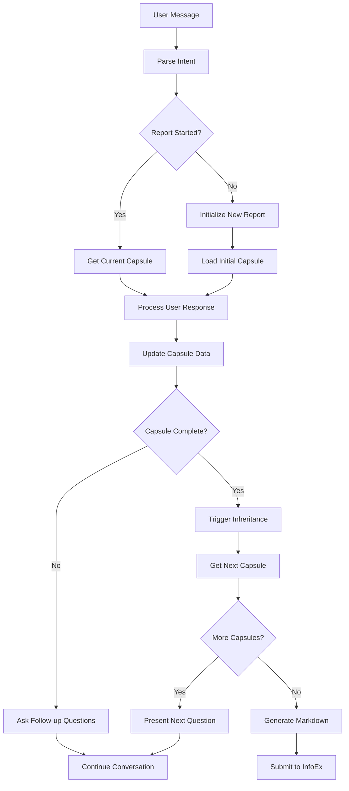

# N8N Capsule Architecture Integration Guide

## 🎯 **Overview: New Capsule-Based Workflow**

The new architecture replaces the old session-based approach with a **database-driven capsule system**. Each report consists of multiple capsules (questions) that guide users through data collection in an optimal sequence.

## 🏗️ **Architecture Components**

### **1. Database-Driven State Machine**
- **Supabase PostgreSQL** stores capsule templates and report data
- **Capsule Templates** define static questions and payload structures
- **Report Capsules** store dynamic user responses and completion status
- **Automatic Inheritance** passes data between capsules via triggers

### **2. Two-Agent System**
- **Agent 1 (Dialogue Agent)**: Handles conversation using capsule questions
- **Agent 2 (Markdown Tool)**: Generates markdown reports from completed data
- **Claude Microservice**: Validates and submits individual capsules to InfoEx

### **3. Optimal Workflow Sequence**
```
1. Initial Data Collection → 2. Field Summary → 3. Avalanche Observation → 
4. Avalanche Summary → 5. Snowpack Summary → 6. Hazard Assessment → 
7. Terrain Observation → 8. Report Review → 9. Markdown Generation → 
10. InfoEx Submission
```

## 🔄 **N8N Workflow Design**

### **Main Workflow Structure**



### **Node-by-Node Implementation**

#### **1. Webhook Trigger Node**
```json
{
  "method": "POST",
  "path": "/webhook/report-collection",
  "authentication": "None"
}
```

#### **2. Parse Intent Node (Code)**
```javascript
// Extract user intent and current session state
const userMessage = $input.first().json.message;
const sessionId = $input.first().json.session_id;

// Check if this is a new report or continuation
const isNewReport = userMessage.toLowerCase().includes('start report') || 
                   userMessage.toLowerCase().includes('new report');

return {
  json: {
    user_message: userMessage,
    session_id: sessionId,
    is_new_report: isNewReport,
    timestamp: new Date().toISOString()
  }
};
```

#### **3. Initialize Report Node (HTTP Request)**
```json
{
  "method": "POST",
  "url": "https://your-supabase-url.supabase.co/rest/v1/rpc/start_new_report",
  "headers": {
    "apikey": "{{ $vars.SUPABASE_ANON_KEY }}",
    "Authorization": "Bearer {{ $vars.SUPABASE_ANON_KEY }}",
    "Content-Type": "application/json"
  },
  "body": {
    "p_user_id": "{{ $json.user_id }}",
    "p_user_name": "{{ $json.user_name }}",
    "p_operation_uuid": "{{ $vars.INFOEX_OPERATION_UUID }}",
    "p_operation_name": "{{ $vars.OPERATION_NAME }}",
    "p_report_date": "{{ $now.format('YYYY-MM-DD') }}",
    "p_timezone": "America/Vancouver"
  }
}
```

#### **4. Get Current Capsule Node (HTTP Request)**
```json
{
  "method": "POST",
  "url": "https://your-supabase-url.supabase.co/rest/v1/rpc/get_next_capsule",
  "headers": {
    "apikey": "{{ $vars.SUPABASE_ANON_KEY }}",
    "Authorization": "Bearer {{ $vars.SUPABASE_ANON_KEY }}",
    "Content-Type": "application/json"
  },
  "body": {
    "p_parent_report_uuid": "{{ $json.parent_report_uuid }}"
  }
}
```

#### **5. Process User Response Node (Code)**
```javascript
// Extract data from user message and update capsule
const userMessage = $input.first().json.user_message;
const currentCapsule = $input.first().json.current_capsule;
const capsuleUuid = currentCapsule.capsule_uuid;

// Parse user response and extract relevant data
// This is where you'd implement natural language processing
// to extract field values from the user's message

const extractedData = parseUserResponse(userMessage, currentCapsule);

return {
  json: {
    capsule_uuid: capsuleUuid,
    extracted_data: extractedData,
    user_message: userMessage
  }
};

function parseUserResponse(message, capsule) {
  // Implement your NLP logic here
  // Extract values based on the current capsule type
  const capsuleType = capsule.report_type;
  
  switch(capsuleType) {
    case 'initial_data_collection':
      return extractInitialData(message);
    case 'field_summary':
      return extractFieldSummaryData(message);
    case 'avalanche_observation':
      return extractAvalancheData(message);
    // ... etc
  }
}
```

#### **6. Update Capsule Field Node (HTTP Request)**
```json
{
  "method": "POST",
  "url": "https://your-supabase-url.supabase.co/rest/v1/rpc/update_capsule_field",
  "headers": {
    "apikey": "{{ $vars.SUPABASE_ANON_KEY }}",
    "Authorization": "Bearer {{ $vars.SUPABASE_ANON_KEY }}",
    "Content-Type": "application/json"
  },
  "body": {
    "p_capsule_uuid": "{{ $json.capsule_uuid }}",
    "p_field_path": ["payload", "field_name"],
    "p_new_value": "{{ $json.extracted_data.field_value }}"
  }
}
```

#### **7. Check Completion Node (HTTP Request)**
```json
{
  "method": "POST",
  "url": "https://your-supabase-url.supabase.co/rest/v1/rpc/get_capsule_progress",
  "headers": {
    "apikey": "{{ $vars.SUPABASE_ANON_KEY }}",
    "Authorization": "Bearer {{ $vars.SUPABASE_ANON_KEY }}",
    "Content-Type": "application/json"
  },
  "body": {
    "p_capsule_uuid": "{{ $json.capsule_uuid }}"
  }
}
```

#### **8. Generate Response Node (Code)**
```javascript
const capsuleProgress = $input.first().json;
const isComplete = capsuleProgress.is_complete;
const missingFields = capsuleProgress.missing_required_fields;

if (isComplete) {
  return {
    json: {
      response: "Great! That completes the " + capsuleProgress.report_type + " section. Let me get the next question for you.",
      is_complete: true,
      next_action: "get_next_capsule"
    }
  };
} else {
  const followUpQuestion = generateFollowUpQuestion(capsuleProgress);
  return {
    json: {
      response: followUpQuestion,
      is_complete: false,
      next_action: "continue_current_capsule"
    }
  };
}

function generateFollowUpQuestion(progress) {
  const missingFields = progress.missing_required_fields;
  const capsuleType = progress.report_type;
  
  // Generate contextual follow-up questions based on missing fields
  // This is where you'd implement your question generation logic
  
  if (missingFields.includes('start_time')) {
    return "What time did you start operations today?";
  } else if (missingFields.includes('end_time')) {
    return "What time did you finish operations?";
  }
  // ... etc
  
  return "I need a bit more information to complete this section.";
}
```

#### **9. Markdown Generation Node (HTTP Request)**
```json
{
  "method": "POST",
  "url": "https://your-supabase-url.supabase.co/rest/v1/rpc/generate_markdown_report",
  "headers": {
    "apikey": "{{ $vars.SUPABASE_ANON_KEY }}",
    "Authorization": "Bearer {{ $vars.SUPABASE_ANON_KEY }}",
    "Content-Type": "application/json"
  },
  "body": {
    "p_parent_report_uuid": "{{ $json.parent_report_uuid }}"
  }
}
```

#### **10. InfoEx Submission Node (HTTP Request)**
```json
{
  "method": "POST",
  "url": "https://infoex-api.onrender.com/api/submit-to-infoex",
  "headers": {
    "Content-Type": "application/json"
  },
  "body": {
    "parent_report_uuid": "{{ $json.parent_report_uuid }}",
    "submission_types": ["field_summary", "avalanche_observation", "hazard_assessment"],
    "state_override": "IN_REVIEW"
  }
}
```

## 📊 **Database Integration Points**

### **Key Supabase Functions Used**

| Function | Purpose | Input | Output |
|----------|---------|-------|--------|
| `start_new_report` | Initialize new report | user_id, operation_uuid | parent_report_uuid |
| `get_next_capsule` | Get current/next question | parent_report_uuid | capsule data |
| `update_capsule_field` | Update field value | capsule_uuid, field_path, value | updated payload |
| `get_capsule_progress` | Check completion status | capsule_uuid | progress data |
| `get_report_progress` | Overall report status | parent_report_uuid | completion summary |
| `submit_report_to_infoex` | Prepare submission | parent_report_uuid | submission payload |

### **Environment Variables Needed**

```bash
SUPABASE_URL=https://your-project.supabase.co
SUPABASE_ANON_KEY=your-anon-key
SUPABASE_SERVICE_KEY=your-service-key
INFOEX_OPERATION_UUID=your-operation-uuid
OPERATION_NAME=Your Operation Name
```

## 🔄 **Workflow States & Transitions**

### **Report States**
1. **INITIALIZING** - Creating new report and first capsule
2. **DATA_COLLECTION** - Collecting data through capsules
3. **REVIEW** - All data collected, ready for review
4. **MARKDOWN_GENERATION** - Creating markdown report
5. **SUBMISSION** - Submitting to InfoEx
6. **COMPLETE** - Report fully processed

### **Capsule States**
1. **PENDING** - Not yet started
2. **IN_PROGRESS** - Currently collecting data
3. **COMPLETE** - All required fields filled
4. **SUBMITTED** - Sent to InfoEx

## 🎯 **Key Implementation Tips**

### **1. Session Management**
- Use `parent_report_uuid` as the primary session identifier
- Store conversation context in n8n's memory or external storage
- Each report maintains its own conversation thread

### **2. Data Inheritance**
- Database automatically handles inheritance via triggers
- No need to manually pass data between capsules
- Focus on collecting current capsule data only

### **3. Error Handling**
- Validate data before updating capsules
- Handle missing required fields gracefully
- Provide clear error messages for validation failures

### **4. Performance Optimization**
- Cache capsule templates to avoid repeated database calls
- Use batch operations for multiple field updates
- Implement proper error retry logic

## 🚀 **Advanced Features**

### **1. Dynamic Question Generation**
```javascript
// Generate contextual questions based on user responses
function generateContextualQuestion(capsuleType, userHistory, missingFields) {
  // Analyze user's previous responses
  // Generate follow-up questions that build on their answers
  // Adapt question complexity based on user expertise
}
```

### **2. Smart Field Extraction**
```javascript
// Extract multiple fields from single user message
function extractMultipleFields(message, capsuleTemplate) {
  const extracted = {};
  
  // Use NLP to identify field values
  // Handle natural language variations
  // Validate extracted values against field definitions
  
  return extracted;
}
```

### **3. Progress Visualization**
```javascript
// Show user their progress through the report
function generateProgressSummary(reportProgress) {
  const completed = reportProgress.completed_capsules.length;
  const total = reportProgress.total_capsules;
  const percentage = Math.round((completed / total) * 100);
  
  return `Report Progress: ${completed}/${total} sections complete (${percentage}%)`;
}
```

## 🔧 **Testing & Debugging**

### **Test Workflow**
1. **Unit Tests** - Test individual nodes with mock data
2. **Integration Tests** - Test complete workflow with test database
3. **User Acceptance Tests** - Test with real user scenarios

### **Debugging Tools**
- Use Supabase dashboard to monitor database changes
- Implement logging in n8n nodes for troubleshooting
- Test individual Supabase functions independently

## 📈 **Monitoring & Analytics**

### **Key Metrics to Track**
- Report completion rates
- Time spent per capsule
- User drop-off points
- Validation error frequency
- InfoEx submission success rates

### **Monitoring Implementation**
```javascript
// Track user interactions and report progress
function trackUserInteraction(sessionId, action, data) {
  // Log to analytics service
  // Track completion metrics
  // Monitor performance bottlenecks
}
```

This architecture provides a robust, scalable foundation for guided report collection while maintaining the flexibility to adapt to different user needs and data requirements.
