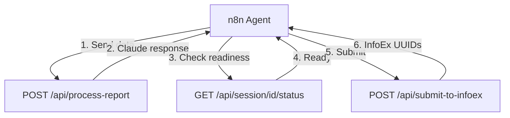

# InfoEx Claude Agent Service - Endpoint Summary

## 🎯 Main Endpoints (What n8n Uses)

### 1. **Process Report with Claude** 
```
POST /api/process-report
```
- **Purpose**: Send observation data to Claude for processing
- **Input**: Raw data from n8n (can be messy/conversational)
- **Output**: Claude's response (parsed data or clarification request)
- **Example**: "Submit avalanche size 3 at Glacier Bowl, natural trigger"

### 2. **Submit to InfoEx**
```
POST /api/submit-to-infoex
```
- **Purpose**: Submit validated payloads to InfoEx API
- **Input**: Session ID + observation types to submit
- **Output**: Success/failure with InfoEx UUIDs
- **Note**: Only call after Claude confirms data is ready

## 📊 Status & Management Endpoints

### 3. **Check Session Status**
```
GET /api/session/{session_id}/status
```
- Shows which payloads are ready
- Lists missing fields
- Tracks conversation progress

### 4. **Clear Session**
```
DELETE /api/session/{session_id}/clear
```
- Start fresh with new data
- Clears conversation history

## 🔧 Utility Endpoints

### 5. **Health Check**
```
GET /health
```
- Service status
- Redis/Claude/InfoEx connectivity

### 6. **Get Locations**
```
GET /api/locations
```
- Available InfoEx locations
- Location UUIDs and names

### 7. **Service Info**
```
GET /
```
- Version info
- Environment
- Available endpoints

### 8. **API Docs**
```
GET /docs
```
- Interactive Swagger UI
- Test endpoints directly

## 🔄 Typical n8n Workflow



## 🎪 What Makes This Different

Unlike direct InfoEx endpoints (`/observation/avalanche`, etc.), this service:
- **Accepts messy data** (Claude cleans it up)
- **Validates against OGRS** standards
- **Handles multiple submissions** from one report
- **Provides conversational feedback** via Claude

The 8 InfoEx observation types are handled **internally** by Claude, not as separate endpoints.
